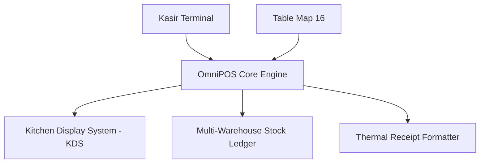

# 🛒 OmniPOS & Retail OS — Enterprise POS, Multi-Warehouse & KDS

> **Live Demo:** [https://olyxmintabansos-byte.github.io/omnipos-os/](https://olyxmintabansos-byte.github.io/omnipos-os/)

OmniPOS adalah sistem operasi kasir ritel & FnB multi-cabang terpadu yang dilengkapi kontrol persediaan multi-gudang, denah 16 meja interaktif, Kitchen Display System (KDS), CRM membership, dan rekonsiliasi laci kas Laporan Z.

## 🚀 Fitur Utama
- **Kasir Transaksi Kilat:** Antarmuka barcode scanner, input diskon, split payment, dan cetak struk thermal 58mm/80mm.
- **Multi-Warehouse & Stock Opname:** Monitoring inventaris antar-gudang, alert minimum stok, dan penyesuaian opname berkala.
- **Floor Plan 16 Meja Restoran:** Pemetaan meja interaktif dengan indikator status (Available, Occupied, Billing).
- **Kitchen Display System (KDS):** Layar antrean pesanan dapur dengan tiket real-time dan notifikasi pesanan selesai.
- **Shift Report & Laporan Z:** Rekonsiliasi modal awal, total omzet, uang fisik laci kas, dan selisih kasir.

## 🏗️ Diagram Arsitektur

