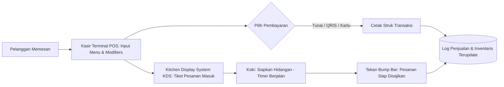

# ☕ OmniPOS OS — Enterprise Point of Sale & Kitchen Display System

<p align="center">
  
  
  
  
  
  
  
</p>

<p align="center">
  🌐 <strong>Live Playable Website:</strong><br>
  👉 <a href="https://olyxmintabansos-byte.github.io/omnipos-os/" target="_blank"><strong>https://olyxmintabansos-byte.github.io/omnipos-os/</strong></a>
</p>

---

> **Sistem Kasir Pintar (POS), Kitchen Display System (KDS), dan Manajemen Inventaris F&B/Ritel Modern Berbasis Next.js 16 & Tailwind v4 — 100% Client-Side, Cepat, dan Siap Operasional.**

Sebagian besar software kasir POS di pasaran mewajibkan biaya langganan bulanan yang mahal serta bergantung penuh pada koneksi internet server pusat. **OmniPOS OS** dirancang untuk kafe, restoran, dan gerai ritel modern dengan filosofi *Local-First*: transaksi cepat tanpa lag, sinkronisasi pesanan langsung ke layar dapur (*KDS Bump Bar*), cetak struk kasir, dan rekap laporan shift harian (Z-Report).

---

## 📑 Daftar Isi

- [Live Demo](#-live-demo)
- [Diagram Alur Pesanan](#-diagram-alur-pesanan)
- [Fitur Utama](#-fitur-utama)
- [Modul Aplikasi](#-modul-aplikasi)
- [Teknologi yang Digunakan](#-teknologi-yang-digunakan)
- [Struktur Folder](#-struktur-folder)
- [Cara Menjalankan Secara Lokal](#-cara-menjalankan-secara-lokal)
- [Lisensi & Atribusi Hak Cipta](#-lisensi--atribusi-hak-cipta)

---

## 🌟 Live Demo

Coba aplikasi kasir & kitchen display langsung di browser Anda:  
👉 **[https://olyxmintabansos-byte.github.io/omnipos-os/](https://olyxmintabansos-byte.github.io/omnipos-os/)**

---

## 🔄 Diagram Alur Pesanan



---

## ✨ Fitur Utama

- ⚡ **High-Speed Touch POS Terminal (`/`):** Grid menu visual dengan kategori (*Food, Beverages, Desserts, Merchandise*), pemilihan opsi varian (*Level Pedas, Less Sugar, Extra Shot*), dan pencarian kode SKU cepat.
- 🍳 **Real-time Kitchen Display System (`/kds`):** Tiket pesanan digital untuk staf dapur dengan indikator waktu tunggu berwarna (Hijau: Baru, Kuning: Berjalan, Merah: Terlambat) dan fitur *Bump Bar* penyelesaian pesanan.
- 📦 **Manajemen Stok Bahan Baku (`/inventory`):** Pelacakan stok otomatis berkurang setiap menu terjual, dilengkapi sistem peringatan stok kritis (*Low Stock Alert*).
- 👥 **Loyalty CRM Pelanggan (`/customers`):** Pencatatan riwayat belanja member, akumulasi poin loyalitas, dan diskon otomatis pelanggan setia.
- 📊 **Laporan Penjualan & Tutup Kasir (`/reports`):** Laporan ringkasan shift (*X/Z-Report*), grafik jam paling ramai (*hourly sales traffic*), dan laba kotor per item menu.
- 🖨️ **Struk Thermal Ready:** Format cetak struk nota belanja yang dioptimalkan untuk printer termal mini 58mm/80mm via dialog print browser.

---

## 🧭 Modul Aplikasi

| Rute | Modul | Fungsi Utama |
|---|---|---|
| `/` | **Kasir POS Terminal** | Pengambilan pesanan pelanggan, input kuantitas, kalkulator kembalian, tender QRIS. |
| `/kds` | **Kitchen Display (KDS)** | Layar antrean dapur digital dengan kontrol bump tiket pesanan. |
| `/inventory` | **Manajemen Stok** | Pemantauan stok persediaan bahan, penyesuaian opname, dan histori restock. |
| `/customers` | **Database Pelanggan** | Direktori pelanggan loyal, poin cashback, dan level tier keanggotaan. |
| `/reports` | **Laporan Finansial** | Rekap omzet harian, analisis metode pembayaran terpopuler, dan export data. |

---

## 🛠️ Teknologi yang Digunakan

- **Framework:** [Next.js 16](https://nextjs.org/) (App Router Architecture)
- **Library UI:** [React 19](https://react.dev/)
- **Bahasa:** [TypeScript](https://www.typescriptlang.org/)
- **Styling:** [Tailwind CSS v4](https://tailwindcss.com/) dengan palet Dark Warm Slate
- **Ikonografi:** [Lucide React](https://lucide.dev/)
- **State & Storage:** React Context API + Browser `localStorage`

---

## 📁 Struktur Folder

```text
omnipos-os/
├── src/
│   ├── app/
│   │   ├── customers/       # CRM & Database Member
│   │   ├── inventory/       # Manajemen Inventaris Bahan Baku
│   │   ├── kds/             # Kitchen Display System
│   │   ├── reports/         # Analisis Penjualan & Z-Report
│   │   ├── globals.css      # Styling Tailwind v4
│   │   ├── layout.tsx       # Root layout & navbar
│   │   └── page.tsx         # Terminal Kasir Utama
│   ├── components/          # Komponen modal tender, kartu menu, tiket pesanan
│   ├── types/               # Type definition produk, pesanan, dan pelanggan
│   └── lib/                 # Utility kalkulasi pajak & diskon
├── public/                  # Aset gambar & ikon
├── package.json
└── tsconfig.json
```

---

## 🚀 Cara Menjalankan Secara Lokal

```bash
# Clone repository
git clone https://github.com/olyxmintabansos-byte/omnipos-os.git
cd omnipos-os

# Install dependensi
npm install

# Jalankan server
npm run dev
```
Buka browser Anda di `http://localhost:3000`.

---

## 📄 Lisensi & Atribusi Hak Cipta

<p align="center">
  
  
</p>

<p align="center">
  Crafted with passion & precision by <strong><a href="https://github.com/olyxmintabansos-byte">Olyx</a></strong><br>
  <strong>© 2026 by Olyx (@olyxmintabansos-byte)</strong>. All rights reserved.<br>
  Distributed under the <a href="https://opensource.org/licenses/MIT">MIT License</a>.
</p>
